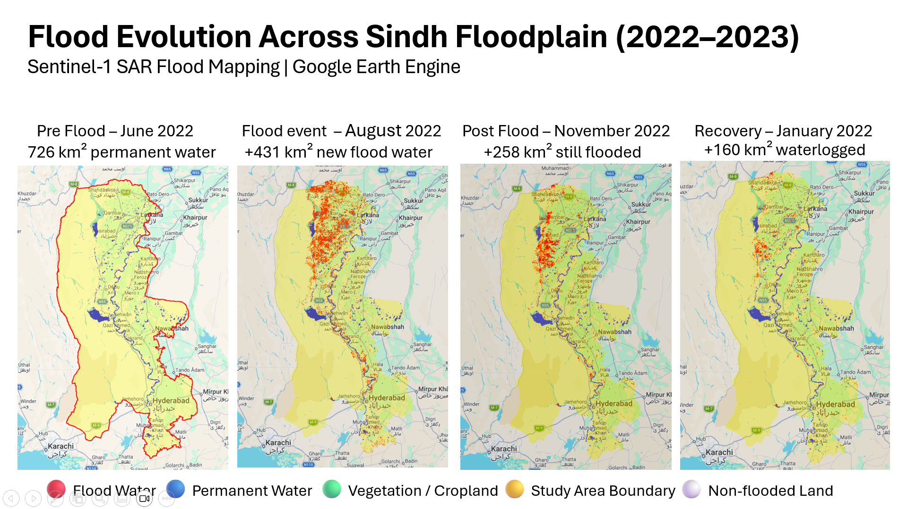
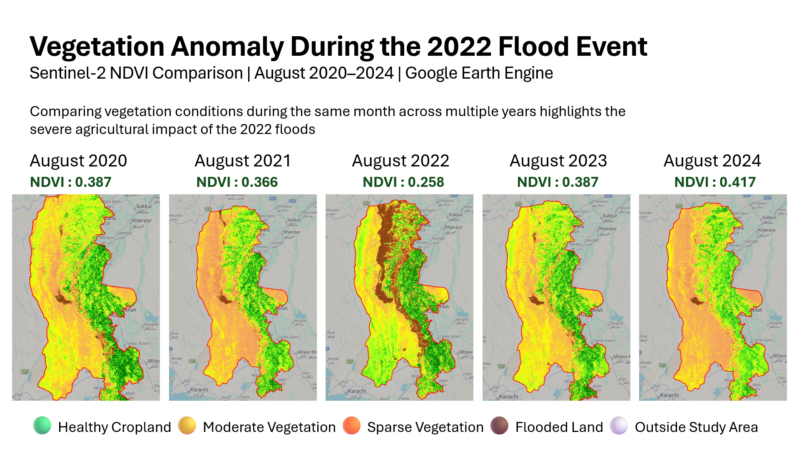

# 🛰️ Mapping the 2022 Pakistan Floods from Space
### SAR Flood Detection & Agricultural Impact Analysis | Google Earth Engine

**Thejas V Bharadwaj**  
MS Space & Astronautical Engineering — Sapienza University of Rome

---

> ⚠️ **Beginner project** — This is my first independent remote sensing analysis. I built this to apply what I'm learning in my Earth Observation and SAR/InSAR coursework to a real-world disaster. I would genuinely appreciate feedback, corrections, or suggestions from anyone with experience in flood mapping or remote sensing!

---

## 📍 Study Area

**5 Districts of Sindh Province, Pakistan:**

| District | Significance |
|---|---|
| Dadu | Worst inundation detected |
| Larkana | Major urban & agricultural centre |
| Naushahro Feroze | Dense Indus floodplain farming |
| Nawabshah (Shaheed Benazirabad) | Key agricultural district |
| Hyderabad | Major city — southern Sindh |

---

## 🎯 What This Project Does

This project uses **free and open satellite data** in **Google Earth Engine** to:

1. **Detect permanent water bodies** pre-flood using Sentinel-1 SAR backscatter
2. **Map pre-flood agricultural land** using Sentinel-2 NDVI + MODIS Land Cover
3. **Track flood evolution** across 4 time periods using SAR change detection
4. **Analyse vegetation impact** using year-on-year NDVI comparison (2020–2024)
5. **Estimate population exposure** using WorldPop 2020 dataset

---

## 📊 Key Findings

### Flood Extent

| Period | Water Area | Notes |
|---|---|---|
| Pre-Flood (Jun 2022) | 726 km² | Permanent water baseline (Manchar Lake + Indus) |
| Peak Flood (Aug 2022) | +431 km² new | Total inundation ~1,157 km² — nearly double baseline |
| Post-Flood (Nov 2022) | +258 km² remaining | Only 40% of flood water drained in 2 months |
| Recovery (Jan 2023) | +160 km² remaining | 63% of flood water still present after 7 months |

### Agricultural Impact (NDVI — Cropland Only, August)

| Year | Mean NDVI | Status |
|---|---|---|
| Aug 2020 | 0.387 | Normal |
| Aug 2021 | 0.366 | Normal |
| Aug 2022 | 0.258 | ⚠️ Flood year — **30% drop** |
| Aug 2023 | 0.387 | Recovering |
| Aug 2024 | 0.417 | ✅ Full recovery |

### Population
- **Total study area population:** ~12.4 million (WorldPop 2020)
- **Population directly in flooded pixels:** ~107,000 (conservative estimate)

---

## 🛠️ Datasets Used

| Dataset | Source | Use |
|---|---|---|
| Sentinel-1 GRD (SAR) | Copernicus / ESA | Flood detection via VH backscatter |
| Sentinel-2 SR Harmonized | Copernicus / ESA | NDVI vegetation mapping |
| MODIS MCD12Q1 Land Cover | NASA | Cropland mask (Classes 12 & 14) |
| JRC Global Surface Water v1.4 | EU Joint Research Centre | Permanent water mask |
| SRTM DEM | USGS | Slope mask to remove false detections |
| WorldPop 2020 (Pakistan) | WorldPop / Univ. Southampton | Population exposure estimation |
| FAO GAUL Level-2 | FAO | District administrative boundaries |

---

## 🔬 Methodology

### 1. SAR Permanent Water Detection (Code 1)
- Sentinel-1 VH polarisation selected — better sensitivity than VV for flat calm water
- Mean composite over May–Jun 2022 (pre-flood baseline)
- Water detected where VH backscatter < –20 dB AND JRC seasonality ≥ 6 months
- SRTM slope mask (< 2°) applied to remove false detections on rough terrain

### 2. Optical Agriculture Mapping (Code 2)
- Sentinel-2 SR median composite, cloud filter < 20%
- NDVI computed from B8 (NIR) and B4 (Red)
- Agricultural vegetation: NDVI 0.35–0.55, constrained by MODIS cropland classes 12 & 14
- Water detected via NDWI > 0.1 combined with JRC Global Surface Water

### 3. SAR Flood Mapping — 4 Time Periods (Code 3)
- Change detection: pixels wet during flood but dry in pre-flood baseline = new flood water
- JRC permanent water mask applied to exclude known water bodies from flood water layer
- Slope mask applied to remove terrain-induced false positives
- Population exposure calculated by overlaying WorldPop raster with flood mask

### 4. NDVI Analysis (Codes 4A & 4B)
- **4A:** NDVI computed for 4 periods using same Sentinel-2 composite method
- **4B:** Year-on-year comparison using August median for 2020–2024 — same Kharif crop season each year to remove seasonal bias
- MODIS cropland mask applied so desert pixels don't dilute the mean NDVI

---

## 🚀 How to Run

All scripts run in [Google Earth Engine Code Editor](https://code.earthengine.google.com/) — no installation required, no setup needed.

### ▶️ Run Directly in Google Earth Engine (One Click)

| Script | Description | GEE Link |
|---|---|---|
| Code 1 — SAR Permanent Water | Sentinel-1 VH backscatter + JRC water detection | [Open in GEE](https://code.earthengine.google.com/31e099d4ee12d037e4786f767ccd9e1d)|
| Code 2 — Optical Agriculture | Sentinel-2 NDVI cropland + water mapping | [Open in GEE](https://code.earthengine.google.com/9d4c366164b3f2851b654109b5cb31b5)) |
| Code 3 — Flood Mapping + Population | SAR change detection 4 periods + WorldPop stats | [Open in GEE](https://code.earthengine.google.com/9d4c366164b3f2851b654109b5cb31b5) |
| Code 4A — NDVI 4 Periods | NDVI pre/during/post flood + recovery | [Open in GEE](https://code.earthengine.google.com/c1507915c14deed27d5597ade7ec333c) |
| Code 4B — NDVI Year Comparison | August NDVI 2020–2024 year-on-year | [Open in GEE](https://code.earthengine.google.com/6b62c963b1aa9c6cfee26ffa5deba98b) |

Scripts are fully independent — each can be run separately.

---

## 📸 Results

### Flood Evolution — Sindh Floodplain (2022–2023)
*Pre-Flood → During Flood → Post-Flood → Recovery*

### Vegetation Impact & Recovery
*NDVI Pre-Flood → During Flood → Post-Flood → Recovery*

### Vegetation Anomaly — Year-on-Year Comparison
*August NDVI 2020–2024 showing the 30% drop in 2022*

---

## 📬 Contact & Feedback

**Thejas V Bharadwaj**  
MS Space & Astronautical Engineering  
Sapienza University of Rome, Italy

- 💼 [LinkedIn](https://www.linkedin.com/in/bharadwajthejasv?lipi=urn%3Ali%3Apage%3Ad_flagship3_profile_view_base_contact_details%3BkUCyziU6SMCTN8omHxGgyA%3D%3D) 
- 📧 bharadwajtysv@gmail.com

---

*Built as a personal portfolio project to demonstrate practical remote sensing and GEE skills. All analysis uses freely available open datasets.*
